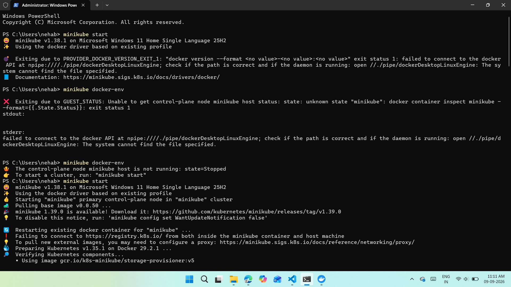
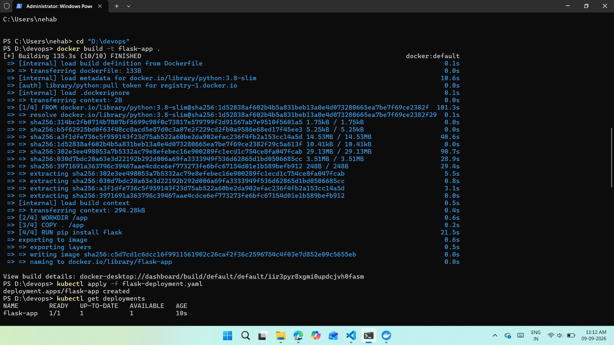
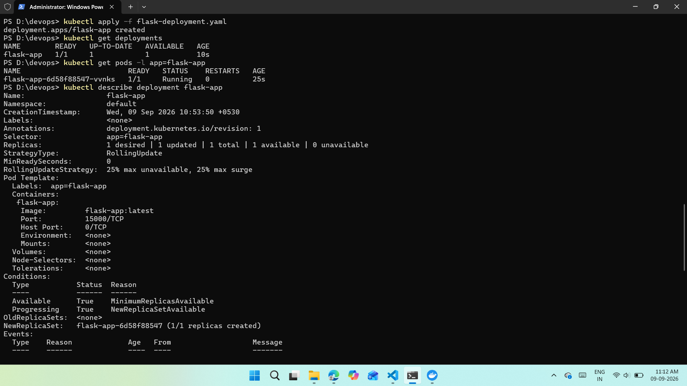
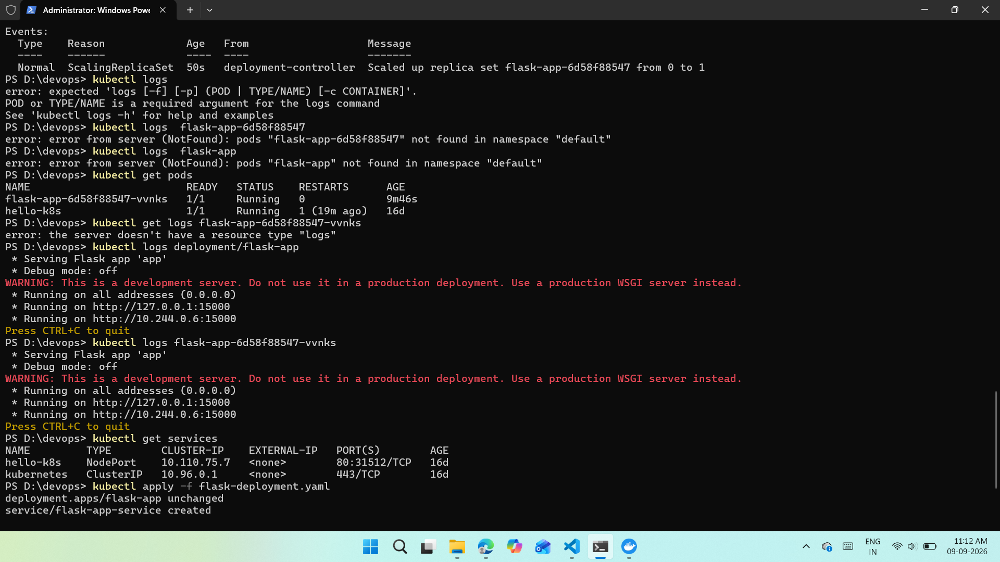
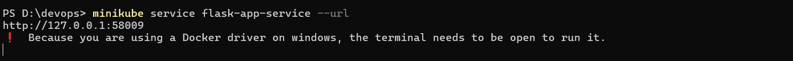

# Kubernetes Basics with Minikube — Flask App Deployment

## 1. Starting Minikube

Ran `minikube start`. The first attempt failed because Docker Desktop wasn't running / reachable:

```
Exiting due to PROVIDER_DOCKER_VERSION_EXIT_1: "docker version --format <no value>-<no value>:<no value>" exit status 1:
failed to connect to the docker API at npipe:////./pipe/dockerDesktopLinuxEngine ...
```

Checked `minikube docker-env`, which confirmed the control-plane node was stopped:

```
The control-plane node minikube host is not running: state=Stopped
To start a cluster, run: "minikube start"
```

After starting Docker Desktop and re-running `minikube start`, the cluster came up successfully — it restarted the existing Docker container for the `minikube` profile, prepared Kubernetes v1.35.1 on Docker 29.2.1, and verified components (storage-provisioner, etc.).

**Note:** Minikube also flagged that v1.39.0 was available for upgrade, and that it had trouble reaching `registry.k8s.io` for new images (a proxy warning), but the existing cached image (v1.38.1 base) let the cluster start regardless.



---

## 2. Building the Flask Docker Image

Navigated to the project folder and built the image directly (using Docker Desktop's engine, since the Minikube docker-env pipe wasn't used this time):

```powershell
cd "D:\devops"
docker build -t flask-app .
```

Build completed successfully in **135.3s**, pulling the `python:3.8-slim` base image, copying the app, and running `pip install flask`:

```
=> [4/4] RUN pip install flask                        21.5s
=> exporting to image                                  0.6s
=> => writing image sha256:c5d7cd1c6dcc16f9911561902c26caf2f36c2596754c4f03e7d852e09c5655eb
=> => naming to docker.io/library/flask-app
```



---

## 3. Deploying to Kubernetes

Applied the deployment manifest:

```powershell
kubectl apply -f flask-deployment.yaml
```

Output:
```
deployment.apps/flask-app created
```

Verified the deployment:

```powershell
kubectl get deployments
```
```
NAME         READY   UP-TO-DATE   AVAILABLE   AGE
flask-app    1/1     1            1           10s
```

Verified the pod:

```powershell
kubectl get pods -l app=flask-app
```
```
NAME                          READY   STATUS    RESTARTS   AGE
flask-app-6d58f88547-vvnks    1/1     Running   0          25s
```

Described the deployment for full detail (`kubectl describe deployment flask-app`) — confirmed:
- **Replicas:** 1 desired | 1 updated | 1 total | 1 available | 0 unavailable
- **Image:** `flask-app:latest`, Port `15000/TCP`
- **Conditions:** `Available = True`, `Progressing = True`
- **Event:** `ScalingReplicaSet` — scaled up replica set `flask-app-6d58f88547` from 0 to 1



---

## 4. Checking Logs

A couple of `kubectl logs` syntax attempts failed first (missing pod/type argument, wrong resource name), which is a normal part of learning the CLI:

```
error: expected 'logs [-f] [-p] (POD | TYPE/NAME) [-c CONTAINER]'
error: error from server (NotFound): pods "flask-app-6d58f88547" not found in namespace "default"
```

Got a full pod list to find the correct pod name:

```powershell
kubectl get pods
```
```
NAME                          READY   STATUS    RESTARTS      AGE
flask-app-6d58f88547-vvnks    1/1     Running   0             9m46s
hello-k8s                     1/1     Running   1 (19m ago)   16d
```

Then successfully pulled logs both by deployment and by pod name:

```powershell
kubectl logs deployment/flask-app
kubectl logs flask-app-6d58f88547-vvnks
```

Both confirmed the Flask dev server was up and listening:

```
* Serving Flask app 'app'
* Debug mode: off
WARNING: This is a development server. Do not use it in a production deployment. Use a production WSGI server instead.
* Running on all addresses (0.0.0.0)
* Running on http://127.0.0.1:15000
* Running on http://10.244.0.6:15000
Press CTRL+C to quit
```

---

## 5. Exposing the App with a Service

Checked existing services:

```powershell
kubectl get services
```
```
NAME         TYPE        CLUSTER-IP     EXTERNAL-IP   PORT(S)        AGE
hello-k8s    NodePort    10.110.75.7    <none>        80:31512/TCP   16d
kubernetes   ClusterIP   10.96.0.1      <none>        443/TCP        16d
```

`flask-app` had no service yet, so I added a `NodePort` Service block (port `15000` → targetPort `15000`) to `flask-deployment.yaml` and re-applied it:

```powershell
kubectl apply -f flask-deployment.yaml
```
```
deployment.apps/flask-app unchanged
service/flask-app-service created
```



---

## 6. Accessing the Flask App

Since Minikube on Windows uses the Docker driver, `minikube service` was needed to tunnel to the service rather than hitting a node IP directly:

```powershell
minikube service flask-app-service --url
```
```
http://127.0.0.1:58009
!   Because you are using a Docker driver on windows, the terminal needs to be open to run it.
```

With that tunnel active, the Flask app running inside the pod was reachable from the host machine on `http://127.0.0.1:58009` — matching the expected end-to-end path:

**External Request → NodePort Service (15000) → Pod container (15000) → Flask app**



---

## Outcome

- Successfully built a Docker image for a Flask app and ran it entirely inside a local Minikube-managed Kubernetes cluster.
- Deployed it via a `Deployment` (1 replica) and confirmed pod health via `kubectl get pods`, `describe`, and `logs`.
- Exposed it externally using a `NodePort` `Service` and Minikube's tunnel (`minikube service --url`), since the Docker driver on Windows doesn't expose node IPs directly to the host.
- Learned/troubleshot along the way: Docker Desktop needing to be running before `minikube start`, correct `kubectl logs` syntax (`kubectl logs <pod-name>` or `kubectl logs deployment/<name>`), and why direct `curl` to the container port fails without a Service + tunnel in place.

## Key Takeaways

| Concept | What it means |
|---|---|
| `imagePullPolicy: Never` | Forces Kubernetes to use the local Docker image instead of pulling from a registry |
| `Deployment` | Manages desired replica count and pod lifecycle/rolling updates |
| `Service` (NodePort) | Exposes pods on a stable port, decoupled from individual pod IPs |
| `minikube service --url` | Required on Docker driver setups (esp. Windows) to actually reach a NodePort service from the host |