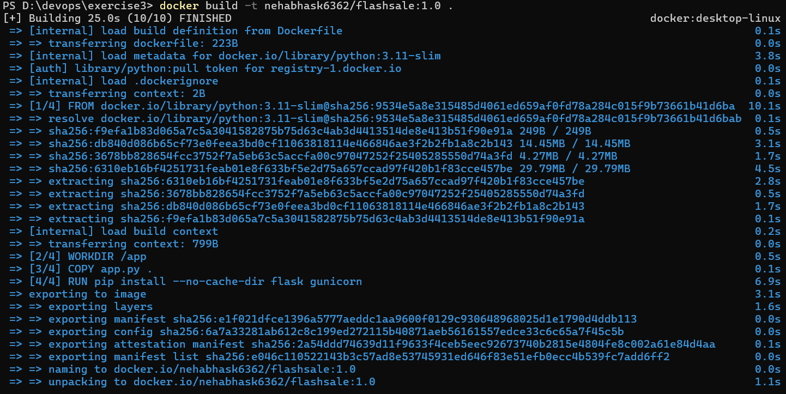
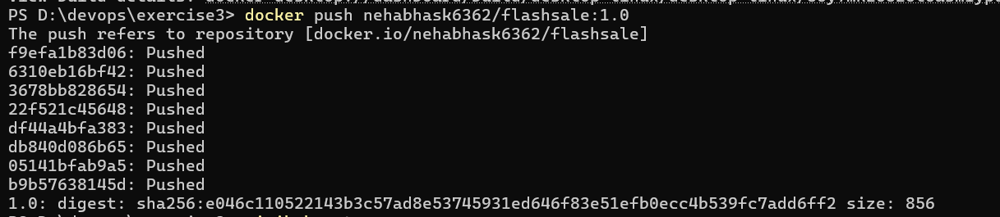
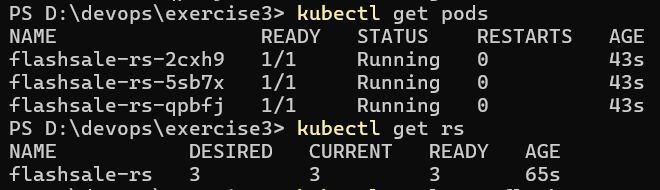
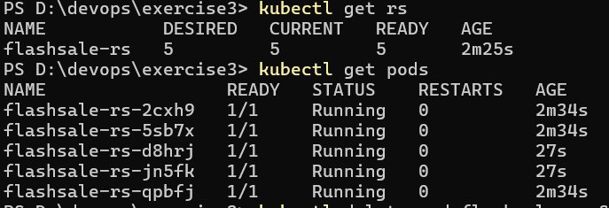
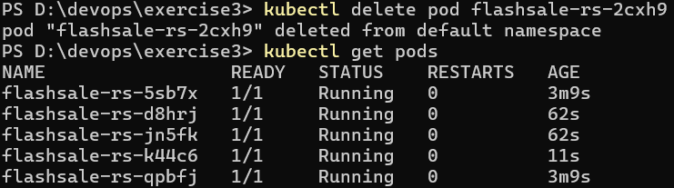
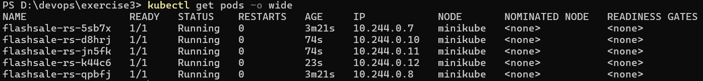

# Exercise 3: Scaling Flask App on a Single Node Using ReplicaSets

## 1. Objective

The objective of this exercise was to understand how Kubernetes ReplicaSets manage multiple identical Pods running a Flask application. The exercise demonstrates:

* Creating and running a Flask application inside a Docker container.
* Building and pushing a Docker image to Docker Hub.
* Creating a Kubernetes ReplicaSet with 3 replicas.
* Scaling the ReplicaSet from 3 to 5 replicas.
* Demonstrating self-healing by deleting a Pod.
* Observing Pod distribution across a single Kubernetes node.

---

## 2. Flask Application

A Flask application was created to simulate an e-commerce flash-sale service.

The application provides the following endpoints:

* `/` – Displays a welcome message and the hostname of the Pod serving the request.
* `/buy` – Simulates a flash-sale purchase and returns the randomly selected product, user, and Pod hostname.
* `/health` – Returns the health status of the application and is used by Kubernetes readiness and liveness probes.

The Pod hostname is returned in the responses so that different Pods can be identified when requests are served.

---

## 3. Docker Image Creation

The Flask application and Dockerfile were placed inside the `exercise3` directory.

The Docker image was built using:

```powershell
docker build -t nehabhask6362/flashsale:1.0 .
```

The build completed successfully. The Dockerfile copied `app.py` into the container and installed Flask and Gunicorn.

The image was then pushed to Docker Hub using:

```powershell
docker push nehabhask6362/flashsale:1.0
```

The push completed successfully and produced the image digest:

```text
sha256:e046c110522143b3c57ad8e53745931ed646f83e51efb0ecc4b539fc7add6ff2
```

### Result

The Flask application was successfully packaged into a Docker image and pushed to Docker Hub.





---

## 4. Starting the Minikube Cluster

The previous Minikube cluster was removed and a new single-node cluster was created using:

```powershell
minikube stop
minikube delete
minikube start --nodes=1
```

The cluster was successfully started.

The node was verified using:

```powershell
kubectl get nodes
```

The result showed:

```text
NAME       STATUS   ROLES           AGE   VERSION
minikube   Ready    control-plane   25s   v1.35.1
```

---

## 5. Creating the ReplicaSet and Service

A Kubernetes configuration file named `flashsale-replicaset.yaml` was created.

The configuration contains:

* A ReplicaSet named `flashsale-rs`
* 3 initial replicas
* A Flask container running on port 5000
* Readiness and liveness probes using `/health`
* CPU and memory resource requests and limits
* A ClusterIP Service named `flashsale-svc`

The ReplicaSet was created using:

```powershell
kubectl apply -f flashsale-replicaset.yaml
```

The output confirmed:

```text
replicaset.apps/flashsale-rs created
service/flashsale-svc created
```

---

## 6. Initial ReplicaSet Verification

The Pods were checked using:

```powershell
kubectl get pods
```

The initial result was:

```text
NAME                 READY   STATUS    RESTARTS   AGE
flashsale-rs-2cxh9   1/1     Running   0          ...
flashsale-rs-5sb7x   1/1     Running   0          ...
flashsale-rs-qpbfj   1/1     Running   0          ...
```

The ReplicaSet was checked using:

```powershell
kubectl get rs
```

The result was:

```text
NAME           DESIRED   CURRENT   READY
flashsale-rs   3         3         3
```

### Result

The ReplicaSet successfully maintained the desired number of **3 Pods**. All three Pods were in the `Running` state and were ready to serve requests.



---

## 7. Scaling the ReplicaSet

The ReplicaSet was scaled from 3 replicas to 5 replicas using:

```powershell
kubectl scale rs flashsale-rs --replicas=5
```

Kubernetes responded:

```text
replicaset.apps/flashsale-rs scaled
```

The ReplicaSet was then verified:

```powershell
kubectl get rs
```

The result was:

```text
NAME           DESIRED   CURRENT   READY
flashsale-rs   5         5         5
```

The Pods were also checked:

```powershell
kubectl get pods
```

Five Pods were found in the `Running` state:

```text
NAME                 READY   STATUS    RESTARTS   AGE
flashsale-rs-2cxh9   1/1     Running   0          ...
flashsale-rs-5sb7x   1/1     Running   0          ...
flashsale-rs-d8hrj   1/1     Running   0          ...
flashsale-rs-jn5fk   1/1     Running   0          ...
flashsale-rs-qpbfj   1/1     Running   0          ...
```

### Result

When the desired replica count was increased from 3 to 5, Kubernetes automatically created **2 additional Pods**.

This demonstrates horizontal scaling using a ReplicaSet.



---

## 8. Demonstrating Self-Healing

To demonstrate the self-healing behavior of the ReplicaSet, one of the running Pods was manually deleted:

```powershell
kubectl delete pod flashsale-rs-2cxh9
```

The Pod was successfully deleted.

The Pods were then checked again:

```powershell
kubectl get pods
```

The output showed a new Pod:

```text
NAME                 READY   STATUS    RESTARTS   AGE
flashsale-rs-5sb7x   1/1     Running   0          ...
flashsale-rs-d8hrj   1/1     Running   0          ...
flashsale-rs-jn5fk   1/1     Running   0          ...
flashsale-rs-k44c6   1/1     Running   0          ...
flashsale-rs-qpbfj   1/1     Running   0          ...
```

The newly created Pod had a different name:

```text
flashsale-rs-k44c6
```

### Result

Although one Pod was manually deleted, the ReplicaSet automatically created a replacement Pod.

The desired number of replicas remained **5**.

This demonstrates Kubernetes' self-healing mechanism.




---

## 9. Pod Distribution Across the Node

The following command was used to inspect Pod placement:

```powershell
kubectl get pods -o wide
```

The result showed:

```text
NAME                 READY   STATUS    IP            NODE
flashsale-rs-5sb7x   1/1     Running   0          10.244.0.7    minikube
flashsale-rs-d8hrj   1/1     Running   0          10.244.0.10   minikube
flashsale-rs-jn5fk   1/1     Running   0          10.244.0.11   minikube
flashsale-rs-k44c6   1/1     Running   0          10.244.0.12   minikube
flashsale-rs-qpbfj   1/1     Running   0          10.244.0.8    minikube
```

### Result

All five Pods were running on the same Kubernetes node:

```text
minikube
```

This is expected because the exercise intentionally uses a **single-node Minikube cluster**.

The Pods have different IP addresses but share the same node.


