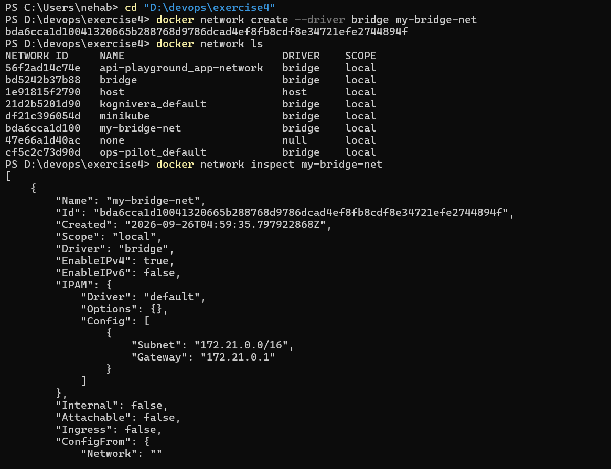
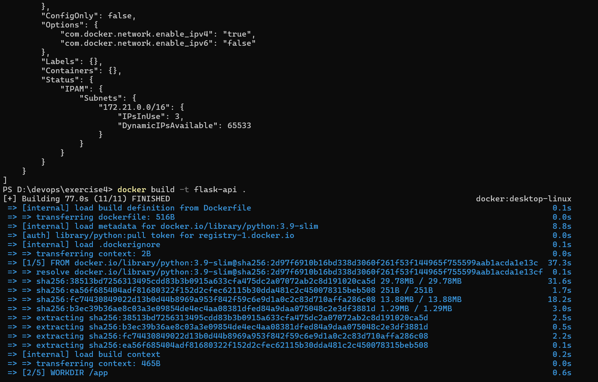
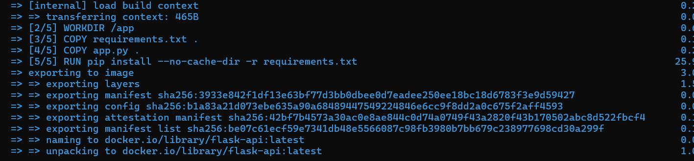
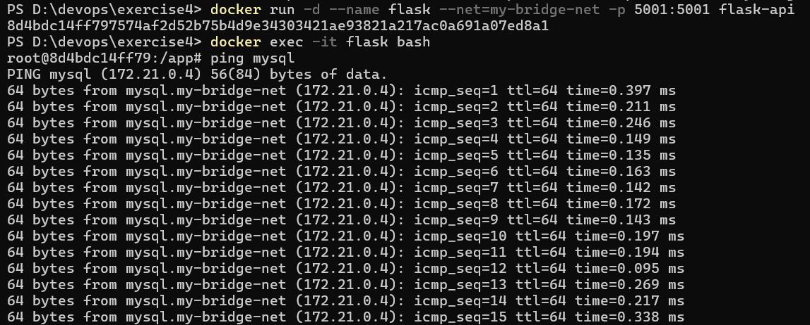
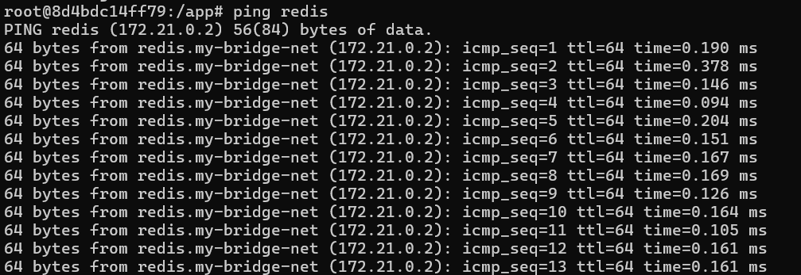
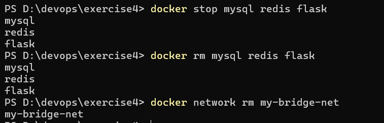

# Exercise 4: Docker Networking with Multiple Containers
## Objective

Understand Docker networking concepts by creating a user-defined bridge network and connecting multiple containers (Flask, MySQL, Redis) to it, then verifying that they can reach each other by name.

## Scenario

A web application made of three containers:

1. **Flask** – Python web server (container 1)
2. **MySQL** – database (container 2)
3. **Redis** – cache (container 3)

All three are attached to one custom bridge network, `my-bridge-net`.

---

## Task 1: Create a Bridge Network

```powershell
docker network create --driver bridge my-bridge-net
```

Docker printed the new network's full ID (`bda6cca1d100…`), confirming the network was created.

## Task 2: Verify the Network

```powershell
docker network ls
```

`my-bridge-net` appears in the list with driver `bridge` and scope `local`, alongside the other existing networks on my machine (`bridge`, `host`, `none`, `minikube`, etc.).

## Task 3: Inspect the Network

```powershell
docker network inspect my-bridge-net
```

Key details from the output:

- **Driver:** `bridge`, **Scope:** `local`
- **Subnet:** `172.21.0.0/16`, **Gateway:** `172.21.0.1`
- **Containers:** `{}` – no containers attached yet
- **Internal / Attachable / Ingress:** all `false`



The end of the inspect output (`Containers: {}` and the IPAM status) is shown here, followed by the start of the Flask image build in Task 4:



---

## Task 4: Build the Flask Image and Launch Containers

### Project files

**`app.py`**

```python
from flask import Flask, jsonify

app = Flask(__name__)

@app.route('/about', methods=['GET'])
def about():
    return jsonify({
        "name": "Simple REST API",
        "version": "1.0",
        "description": "This is a simple REST API built with Flask."
    })

if __name__ == '__main__':
    app.run(debug=True, port=5001)
```

**`requirements.txt`**

```
Flask==2.0.1
```

**`Dockerfile`**

```dockerfile
FROM python:3.9-slim
WORKDIR /app
COPY requirements.txt .
COPY app.py .
RUN pip install --no-cache-dir -r requirements.txt
EXPOSE 5001
CMD ["python", "app.py"]
```

### Build the image

```powershell
docker build -t flask-api .
```

The build completed successfully (`FINISHED`, about 77 s). It pulled `python:3.9-slim`, then ran the 5 steps: base image → `WORKDIR /app` → `COPY requirements.txt` → `COPY app.py` → `RUN pip install`. The image was tagged `docker.io/library/flask-api:latest`.




### Launch the containers

All three containers were started in detached mode (`-d`) on `my-bridge-net`.

**MySQL** – the `mysql` image refuses to start without a root password, so I passed `MYSQL_ROOT_PASSWORD` (this differs from the lab's sample command):

```powershell
docker run -d --name mysql --net=my-bridge-net -e MYSQL_ROOT_PASSWORD=root mysql:latest
```


**Redis**

```powershell
docker run -d --name redis --net=my-bridge-net redis:latest
```

**Flask** – additionally publishes port 5001 to the host:

```powershell
docker run -d --name flask --net=my-bridge-net -p 5001:5001 flask-api
```

Each command printed a container ID, confirming it started.

---

## Task 5: Test Connectivity

Opened a shell inside the Flask container:

```powershell
docker exec -it flask bash
```

### Ping MySQL

```bash
ping mysql
```

The name `mysql` resolved to **172.21.0.4** and every packet got a reply (~0.1–0.4 ms, `ttl=64`).



### Ping Redis

```bash
ping redis
```

The name `redis` resolved to **172.21.0.2**, again with replies in ~0.1–0.4 ms.



### Observation

Docker's built-in DNS on a user-defined bridge network resolved the container names (shown as `mysql.my-bridge-net` and `redis.my-bridge-net`) to their IPs automatically, so no IP addresses had to be hard-coded.

| Container | IP address on `my-bridge-net` |
|---|---|
| redis | 172.21.0.2 |
| mysql | 172.21.0.4 |
| flask | attached to the same subnet (`172.21.0.0/16`) |

---

## Task 6: Clean Up

```powershell
docker stop mysql redis flask
docker rm mysql redis flask
docker network rm my-bridge-net
```

All three containers were stopped and removed, and the network `my-bridge-net` was deleted.



---

