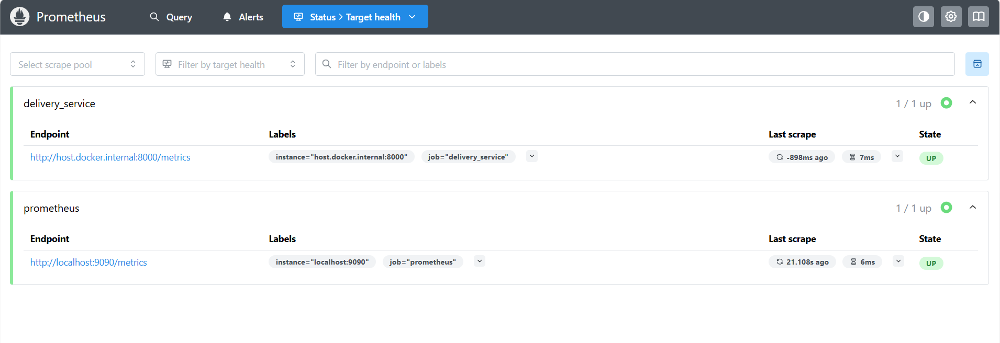
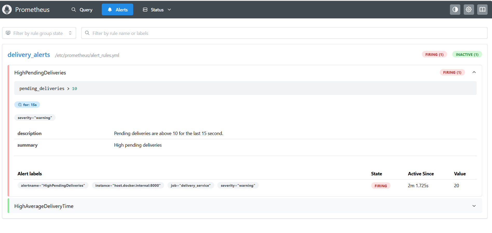
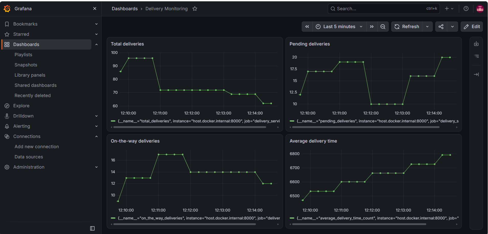
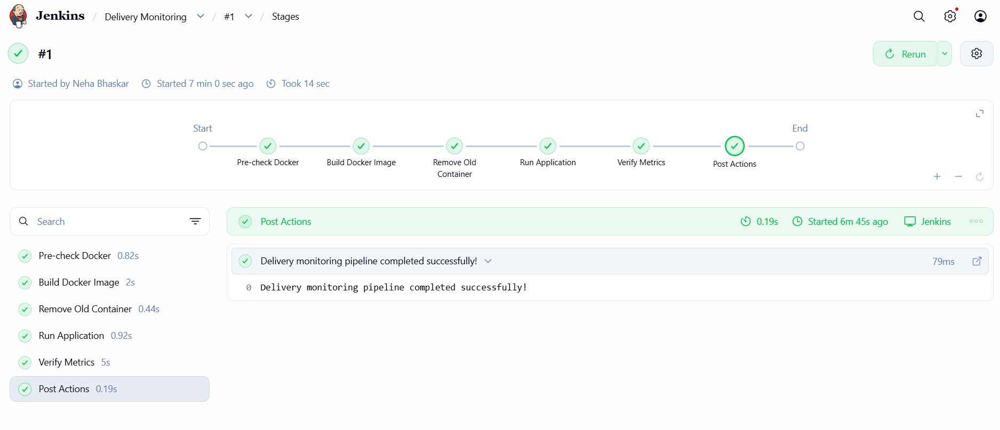
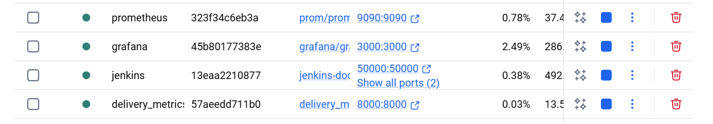

# Exercise 6- ZAPPTTO Delivery Monitoring: Real-Time Operations Monitoring and Alerting

A small monitoring stack for a fast-paced delivery service. A Python app simulates delivery metrics, **Prometheus** scrapes them and evaluates alert rules, **Grafana** visualizes them, and **Jenkins** automates building and running the application.


| Component | Container | Port | Purpose |
|---|---|---|---|
| Delivery metrics app | `delivery_metrics` | 8000 | Exposes simulated metrics at `/metrics` |
| Prometheus | `prometheus` | 9090 | Scrapes metrics, evaluates alerts |
| Grafana | `grafana` | 3000 | Dashboards |
| Jenkins | `jenkins` | 8080, 50000 | CI/CD pipeline |

## Prerequisites

- Docker
- Python 3.10+
- `prometheus-client` (`pip install prometheus-client`)

## Results

### Prometheus targets are up

Both `delivery_service` and `prometheus` scrape targets report `UP`.



### Alert firing

`HighPendingDeliveries` fires when `pending_deliveries > 10` for 15 seconds. In the run below it is firing with a value of 20.



### Grafana dashboard



### Jenkins pipeline

All stages passed in build #1.



Console output:
```bash
Started by user Neha Bhaskar

[Pipeline] Start of Pipeline
[Pipeline] node
Running on Jenkins
 in /var/jenkins_home/workspace/Delivery Monitoring
[Pipeline] {
[Pipeline] stage
[Pipeline] { (Pre-check Docker)
[Pipeline] sh
+ docker --version
Docker version 26.1.5+dfsg1, build a72d7cd
[Pipeline] sh
+ docker info
Client:
 Version:    26.1.5+dfsg1
 Context:    default
 Debug Mode: false
 Plugins:
  buildx: Docker Buildx (Docker Inc.)
    Version:  0.13.1+ds1
    Path:     /usr/libexec/docker/cli-plugins/docker-buildx

Server:
 Containers: 21
  Running: 3
  Paused: 0
  Stopped: 18
 Images: 36
 Server Version: 29.2.1
 Storage Driver: overlayfs
  driver-type: io.containerd.snapshotter.v1
 Logging Driver: json-file
 Cgroup Driver: cgroupfs
 Cgroup Version: 2
 Plugins:
  Volume: local
  Network: bridge host ipvlan macvlan null overlay
  Log: awslogs fluentd gcplogs gelf journald json-file local splunk syslog
 CDI spec directories:
  /etc/cdi
  /var/run/cdi
 Swarm: inactive
 Runtimes: io.containerd.runc.v2 nvidia runc
 Default Runtime: runc
 Init Binary: docker-init
 containerd version: dea7da592f5d1d2b7755e3a161be07f43fad8f75 (expected: )
 runc version: v1.3.4-0-gd6d73eb8 (expected: )
 init version: de40ad0 (expected: )
 Security Options:
  seccomp
   Profile: builtin
  cgroupns
 Kernel Version: 6.6.87.2-microsoft-standard-WSL2
 Operating System: Docker Desktop
 OSType: linux
 Architecture: x86_64
 CPUs: 16
 Total Memory: 7.428GiB
 Name: docker-desktop
 ID: 64a25a7e-a247-44fd-a03c-e9df1cd63b76
 Docker Root Dir: /var/lib/docker
 Debug Mode: false
 HTTP Proxy: http.docker.internal:3128
 HTTPS Proxy: http.docker.internal:3128
 No Proxy: hubproxy.docker.internal
 Labels:
  com.docker.desktop.address=npipe://\\.\pipe\docker_cli
 Experimental: false
 Insecure Registries:
  hubproxy.docker.internal:5555
  ::1/128
  127.0.0.0/8
 Live Restore Enabled: false

[Pipeline] }
[Pipeline] // stage
[Pipeline] stage
[Pipeline] { (Build Docker Image)
[Pipeline] sh
+ cd /delivery_monitoring
+ docker build -t delivery_metrics .
#0 building with "default" instance using docker driver

#1 [internal] load build definition from Dockerfile
#1 transferring dockerfile: 199B 0.0s done
#1 DONE 0.1s

#2 [internal] load metadata for docker.io/library/python:3.12-slim
#2 DONE 1.1s

#3 [internal] load .dockerignore
#3 transferring context: 2B 0.0s done
#3 DONE 0.2s

#4 [internal] load build context
#4 transferring context: 41B 0.0s done
#4 DONE 0.1s

#5 [1/4] FROM docker.io/library/python:3.12-slim@sha256:ddb0207ae1f0356c2b724d740769b0c5f5f51cc54a0525178f721825f78fe74c
#5 resolve docker.io/library/python:3.12-slim@sha256:ddb0207ae1f0356c2b724d740769b0c5f5f51cc54a0525178f721825f78fe74c 0.1s done
#5 DONE 0.1s

#6 [2/4] WORKDIR /app
#6 CACHED

#7 [3/4] RUN pip install prometheus-client
#7 CACHED

#8 [4/4] COPY delivery_metrics.py .
#8 CACHED

#9 exporting to image
#9 exporting layers done
#9 exporting manifest sha256:ea3782bae4ba8ccf221523b6e2c9eabdda55651d5c0d53362755992d393ba823 done
#9 exporting config sha256:4974dd00e29bf9204ef503a8ae483a7e085500ccf51b24eda9582f4f6055bbf2 done
#9 exporting attestation manifest sha256:02bab3e8ec9334292577e580a81ec1586dbdd28a91542810cca769450bf92676 0.1s done
#9 exporting manifest list sha256:29d7f9c9c13fbf4a28fb32b29fa0416ce8ecbd1fd39db7a08ddd64334bd853ec
#9 exporting manifest list sha256:29d7f9c9c13fbf4a28fb32b29fa0416ce8ecbd1fd39db7a08ddd64334bd853ec 0.1s done
#9 naming to docker.io/library/delivery_metrics:latest done
#9 unpacking to docker.io/library/delivery_metrics:latest 0.0s done
#9 DONE 0.3s
[Pipeline] }
[Pipeline] // stage
[Pipeline] stage
[Pipeline] { (Remove Old Container)
[Pipeline] sh
+ docker rm -f delivery_metrics
[Pipeline] }
[Pipeline] // stage
[Pipeline] stage
[Pipeline] { (Run Application)
[Pipeline] sh
+ docker run -d --name delivery_metrics -p 8000:8000 delivery_metrics
57aeedd711b020375c0f167930638f00e3f7d582160a35fe6b3e50ecc504bc18
[Pipeline] }
[Pipeline] // stage
[Pipeline] stage
[Pipeline] { (Verify Metrics)
[Pipeline] sh
+ sleep 5
+ curl -f http://host.docker.internal:8000/metrics
  % Total    % Received % Xferd  Average Speed   Time    Time     Time  Current
                                 Dload  Upload   Total   Spent    Left  Speed

  0     0    0     0    0     0      0      0 --:--:-- --:--:-- --:--:--     0
100  1708  100  1708    0     0   174k      0 --:--:-- --:--:-- --:--:--  185k
# HELP python_gc_objects_collected_total Objects collected during gc
# TYPE python_gc_objects_collected_total counter
python_gc_objects_collected_total{generation="0"} 334.0
python_gc_objects_collected_total{generation="1"} 5.0
python_gc_objects_collected_total{generation="2"} 0.0
# HELP python_gc_objects_uncollectable_total Uncollectable objects found during GC
# TYPE python_gc_objects_uncollectable_total counter
python_gc_objects_uncollectable_total{generation="0"} 0.0
python_gc_objects_uncollectable_total{generation="1"} 0.0
python_gc_objects_uncollectable_total{generation="2"} 0.0
# HELP python_gc_collections_total Number of times this generation was collected
# TYPE python_gc_collections_total counter
python_gc_collections_total{generation="0"} 13.0
python_gc_collections_total{generation="1"} 1.0
python_gc_collections_total{generation="2"} 0.0
# HELP python_info Python platform information
# TYPE python_info gauge
python_info{implementation="CPython",major="3",minor="13",patchlevel="5",version="3.13.5"} 1.0
# HELP total_deliveries Total number of deliveries
# TYPE total_deliveries gauge
total_deliveries 86.0
# HELP pending_deliveries Number of pending deliveries
# TYPE pending_deliveries gauge
pending_deliveries 11.0
# HELP on_the_way_deliveries Number of deliveries on the way
# TYPE on_the_way_deliveries gauge
on_the_way_deliveries 7.0
# HELP average_delivery_time Average delivery time in seconds
# TYPE average_delivery_time summary
average_delivery_time_count 6642.0
average_delivery_time_sum 199313.8284511502
# HELP average_delivery_time_created Average delivery time in seconds
# TYPE average_delivery_time_created gauge
average_delivery_time_created 1.7912622447114072e+09
[Pipeline] }
[Pipeline] // stage
[Pipeline] stage
[Pipeline] { (Declarative: Post Actions)
[Pipeline] echo
Delivery monitoring pipeline completed successfully!
[Pipeline] }
[Pipeline] // stage
[Pipeline] }
[Pipeline] // node
[Pipeline] End of Pipeline
Finished: SUCCESS
```

### Running containers

`prometheus`, `grafana`, `jenkins` and `delivery_metrics` are all up.



## Simulating Alerts

The default `pending` range is `random.randint(10, 20)`, which already exceeds the alert threshold most of the time. To push it well past the threshold, edit `delivery_metrics.py`:

```python
pending = random.randint(50, 100)
```

Then rebuild/restart the app (re-run the Jenkins pipeline) and check **Alerts** in the Prometheus UI.

## Cleanup

```bash
docker rm -f delivery_metrics prometheus grafana jenkins
```