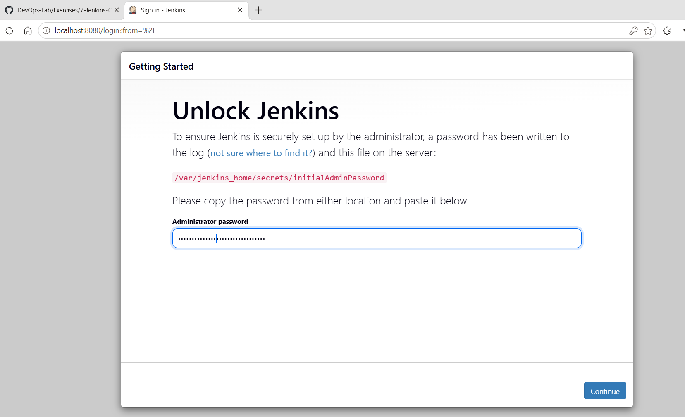
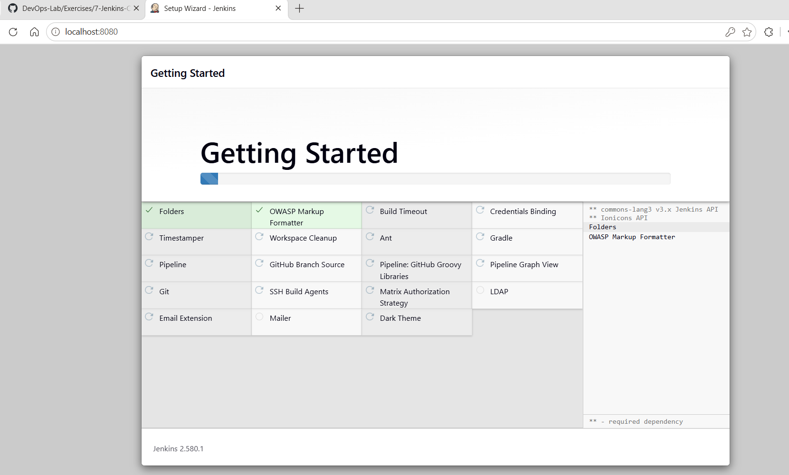
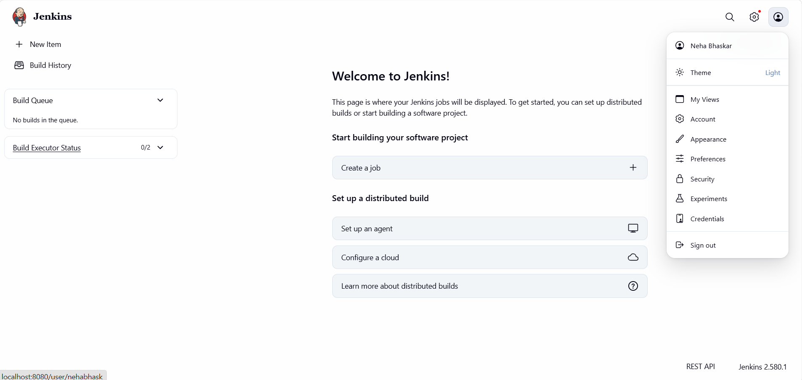

# Exercise 7: Installing Jenkins with Docker

## Objective

Install Jenkins (LTS) as a Docker container, retrieve the initial admin password, and complete the first-time setup wizard to reach the Jenkins dashboard.

## Prerequisites

- Docker installed and running
- Ports `8080` (web UI) and `50000` (agent communication) free on the host
- A web browser

---

## Step 1: Run the Jenkins container

```bash
docker run -d --name jenkins -p 8080:8080 -p 50000:50000 jenkins/jenkins:lts
```

| Flag | Purpose |
|------|---------|
| `-d` | Run the container in the background (detached) |
| `--name jenkins` | Name the container `jenkins` |
| `-p 8080:8080` | Map the Jenkins web UI to host port 8080 |
| `-p 50000:50000` | Map the port used by Jenkins agents |
| `jenkins/jenkins:lts` | Official Jenkins Long-Term Support image |

**Result:** Docker returned the full container ID, confirming the container was created:

```
2c5b20ef084fe60e67be4935d725c61629f31f8268778ee9443e21fd6a378586
```

## Step 2: Verify the container is running

```bash
docker ps -a
```

**Result:**

```
CONTAINER ID   IMAGE                 COMMAND                  CREATED              STATUS              PORTS                                                                                      NAMES
2c5b20ef084f   jenkins/jenkins:lts   "/usr/bin/tini -- /u…"   About a minute ago   Up About a minute   0.0.0.0:8080->8080/tcp, [::]:8080->8080/tcp, 0.0.0.0:50000->50000/tcp, [::]:50000->50000/tcp   jenkins
```

The status is `Up`, and both ports are mapped to the host.

## Step 3: Get the initial admin password

Open a shell inside the container:

```bash
docker exec -it 2c5b20ef084f bash
```

Print the password:

```bash
jenkins@2c5b20ef084f:/$ cat /var/jenkins_home/secrets/initialAdminPassword
```

Copy the value that is printed (a 32-character hexadecimal string). It is needed in the next step.

## Step 4: Unlock Jenkins

Browse to **http://localhost:8080/**. Jenkins asks for the administrator password. Paste the value from Step 3 and click **Continue**.



## Step 5: Install plugins (Getting Started)

Choose **Install suggested plugins**. Jenkins downloads and installs the recommended set, including Folders, Pipeline, Git, Credentials Binding, Timestamper, Gradle, Email Extension, Matrix Authorization Strategy, and others.



## Step 6: Create the admin user and finish setup

After the plugins finish installing:

1. Create the first admin user (username, password, full name, email).
2. Confirm the Jenkins URL (`http://localhost:8080/`).
3. Click **Start using Jenkins**.

## Step 7: Confirm the Jenkins dashboard

The setup is complete when the **Welcome to Jenkins!** dashboard loads. It shows the Build Queue (empty), the Build Executor Status (0/2), and the **Create a job** option. The footer shows the installed version, **Jenkins 2.580.1**, and the logged-in user is shown in the top-right menu.



---

## Results summary

| Check | Outcome |
|-------|---------|
| Jenkins LTS image pulled and container started | Success |
| Container status in `docker ps -a` | `Up`, ports 8080 and 50000 mapped |
| Initial admin password retrieved | Success |
| Unlock screen passed | Success |
| Suggested plugins installed | Success |
| Dashboard reachable at `localhost:8080` | Success (Jenkins 2.580.1) |
